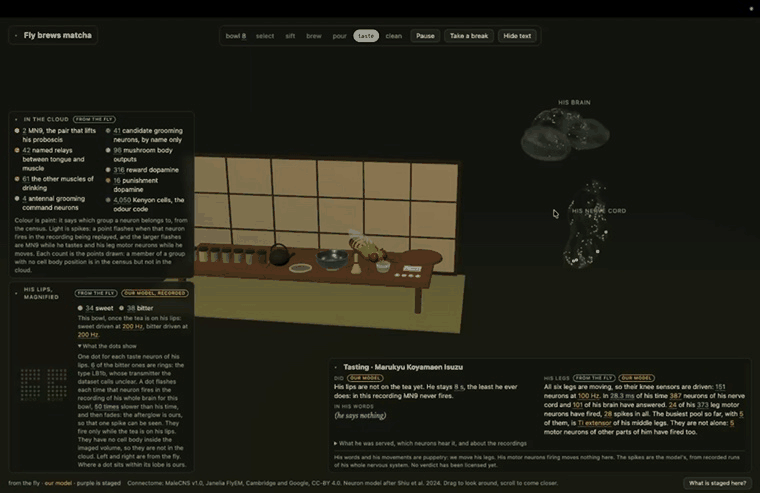
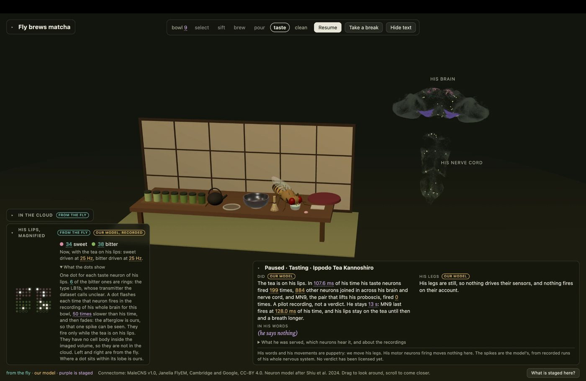
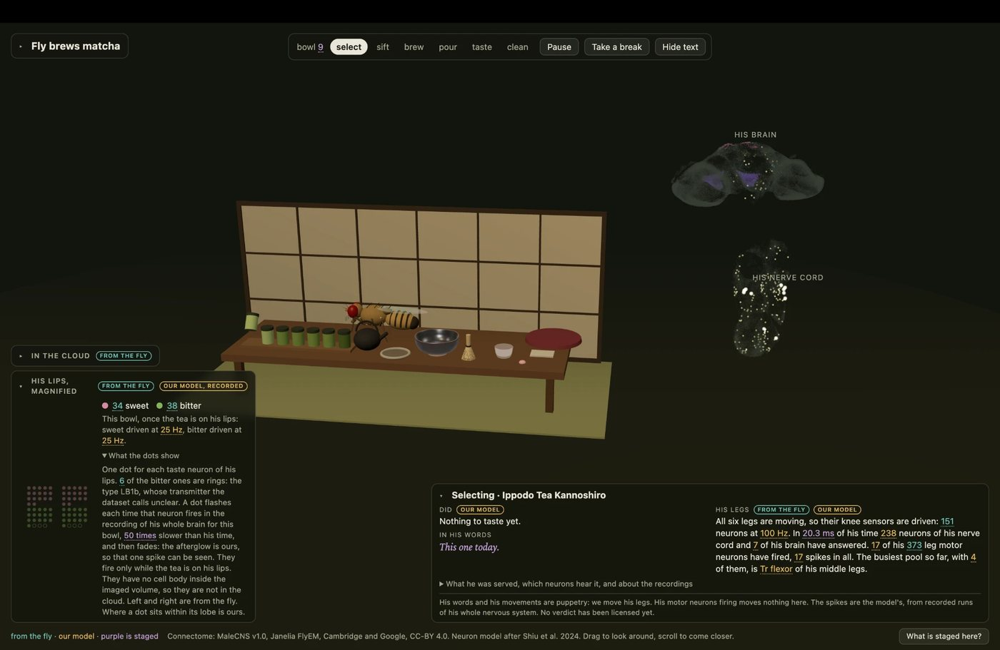
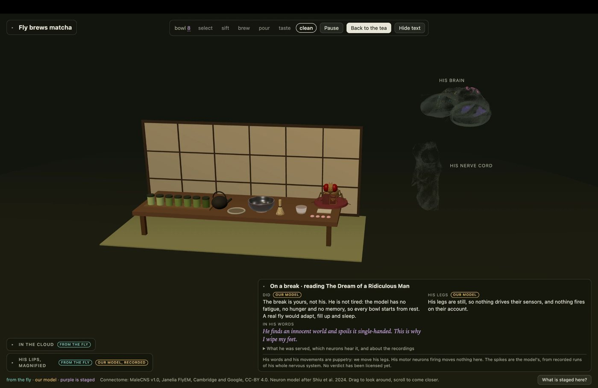

# Fly brews Matcha?

**Matcha Fly.** Host a tea ceremony for one simulated male fruit fly. Each sip is tasted by a spiking model running on his real wiring, the MaleCNS v1.0 connectome, and his whole nervous system answers beside him. Later you will be able to bet on what a cell type does, silence it and find out. A Python lab runs the same model on the whole connectome, with controls, and is the only place where a game mechanic can earn the right to ship.

The plan, the rules and the current status live in [specs/matcha-fly/README.md](specs/matcha-fly/README.md). Start there.

## See it



The loop, recorded from the page. He selects a tea, sifts, brews, pours, tastes and cleans up, then sits down with Dostoevsky until he is sent back to work. Every flash beside him is a spike: his lips while the tea is on them, his nerve cord while his legs move.



**Tasting, paused.** Space holds the moment with its light so the card can be read: what he was served, which neurons hear it, what his brain did with it. Here 884 neurons have joined in across his brain and nerve cord, and MN9, the pair that lifts his proboscis, has not fired at all.



**He moves, and his nerves show it.** We move his legs, and that is puppetry; but a moving knee is a real stimulus to the knee's own sensors, so while he walks the page replays his whole nervous system with those 151 sensors driven. The cord answers, then the brain, and 17 of his 373 leg motor neurons fire. Their firing moves nothing on screen, and the page says so.



**A break is not a freeze.** Send him off and he puts down what he is holding, walks to his cushion and reads Dostoevsky until you send him back. He is not tired: this model has no fatigue, no hunger and no memory, and the card says that too.

## Run what exists

```sh
make venv                                        # installs pinned packages from PyPI: ask before downloading
.venv/bin/python -m flylab data plan --stage A   # what would be fetched, from response headers only
.venv/bin/python -m flylab data fetch --stage A --yes
.venv/bin/python -m flylab census taste          # writes circuits/taste.lock.json and circuits/taste.census.html
.venv/bin/python -m flylab data fetch --stage B --yes   # 508 MB of wiring: ask before downloading
.venv/bin/python -m flylab graph build           # the whole brain as one file, under data/built/full/ (never committed)
.venv/bin/python -m flylab web recordings        # his answer to each of the 25 sips and to his legs moving, for the page to replay
make check
```

## Watch him brew

```sh
make web     # installs the page's packages from npm: ask before downloading
make dev     # then open http://localhost:5173
```

He selects a tea, sifts, brews, pours, tastes and cleans up, forever, beside the cloud of his 138,556 placed neurons. Two things make that cloud light up, and both are recordings of his whole nervous system on his real wiring, 164,506 neurons, slowed fifty times: the tea on his lips, and his own legs moving. How long he stays with the cup comes from the last spike of MN9, the pair of motor neurons that lifts his proboscis, in that bowl's recording. These are pilot recordings, what was measured and not yet a verdict, so he does not drink yet.

**Space** holds the moment exactly as it is, light and all, so the card can be read. **B** sends him for a break with Dostoevsky. **H** hides all text, every panel folds, and **What is staged here?** tints everything that is puppetry. `?sip=3&phase=taste&at=0.5` opens the page as a still of one moment, `&moved=2` with his legs two seconds into a movement.

## Layout

- `lab/flylab/` the Python lab: data with provenance, the census, later the graph, the reference model and the experiments.
- `web/` the page: a three.js scene, the endless ceremony, and the honesty tags. Pure modules with tests; only `scene.ts`, `fly.ts` and `crockery.ts` know three.js.
- `contracts/` what both languages must agree on: the neuron model, trials, the codec and the fixtures that bind them.
- `circuits/` which neurons play which role, as data, with the evidence for each binding: the taste circuit, and the motor pools and knee sensors of his six legs.
- `data/raw/` source files. Never committed.
- `specs/matcha-fly/` the plan, its contracts and the evidence each slice was accepted on.
- `assets/showcase/` the pictures and the loop above, recorded from the running page. Nothing here is computed; it is what the page looked like.

## Data and credit

The connectome is MaleCNS v1.0 by the FlyEM Project Team at HHMI Janelia, the Drosophila Connectomics Group at Cambridge and Google Research, licensed CC-BY 4.0. Connectivity is real. Signs, weights, doses and behaviour are models, and the project says so wherever they appear. This is an experiment with biological structure, not a validated digital fly.
